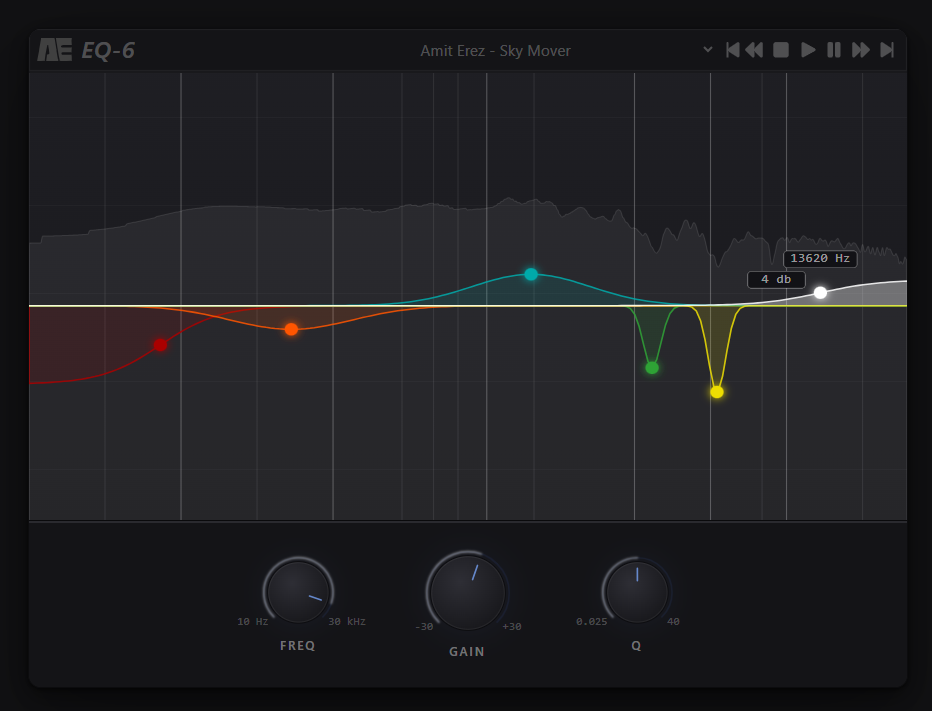

# EQ-6 — Interactive Audio Equalizer

A browser-based parametric EQ with real-time audio processing and responsive visual feedback.
Built to explore the relationship between audio signal processing and UI/UX in professional audio tools.

## Preview

## Features

- 6-band parametric EQ (low shelf → bell → high shelf)
- Real-time audio processing using Web Audio API
- Interactive SVG-based EQ graph
- Draggable handles with frequency, gain, and Q control
- Live spectrum analyzer with EQ-influenced visualization
- Smooth visual feedback tuned for responsiveness and clarity
- Built-in audio player with multiple tracks for real-time EQ testing
- Playback controls (play, pause, stop, seek, track switching)

## Audio Playback & Testing Environment

To make the EQ fully interactive and testable in isolation, I implemented a built-in audio player:

- Multiple tracks for varied frequency content
- Playback controls (play, pause, skip, seek)
- Direct connection to the EQ signal chain

This allows immediate auditory and visual feedback without relying on external audio input.

## Tech Stack

- React
- TypeScript
- Vite
- Tailwind CSS
- Web Audio API
- SVG for custom graph rendering

## Key Concepts & Decisions

### 1. Separation of Audio vs Visualization

The analyzer and EQ visuals are intentionally decoupled:

- Audio processing uses real filter nodes (BiquadFilterNode)
- Visual feedback blends real analyzer data with EQ influence

This improves perceived responsiveness, since raw analyzer data alone does not clearly reflect subtle EQ changes.

---

### 2. Logarithmic Frequency Mapping

Frequency is mapped logarithmically across the graph to match human hearing:

- Low frequencies get more visual space
- High frequencies are compressed

---

### 3. Single Source of Truth (Bands Array)

Each band is represented as an object: { type, freqValue, gainValue, qValue, color }

## Responsiveness

This project is intentionally desktop-only.

Audio production tools (EQs, DAWs, plugins) are designed for precision interaction
and are typically used on large screens with mouse input.

For this reason, I prioritized:

- precise dragging interactions
- dense visual information
- fixed graph dimensions for consistency

A responsive version could be implemented with simplified controls and layout adjustments, 
but was intentionally out of scope.

## Future Improvements

- Multi-layer analyzer (fast + slow response like pro EQs)
- Toggleable combined EQ response curve
- Presets / saving EQ settings
- Touch-friendly controls for tablet use
